# 🏠 Hosta Provider App

**Hosta Provider** is a Flutter-based mobile application designed for service providers to manage bookings, availability, notifications, and customer interactions in real time.

This project focuses on **scalable architecture**, **real-time communication**, and **production-ready Flutter practices**.

---

## 🚀 Features
- Provider authentication & onboarding
- OTP verification flow
- Booking management system
- Real-time notifications
- Availability & working hours management
- Profile & service management
- Light & Dark mode support
- Multi-language support

---

## 🧠 Architecture
The application follows **Clean Architecture** principles with a clear separation of concerns:

## 📸 Screenshots

### First Use & Authentication
| First Use | Login |
|---------|-------|
| 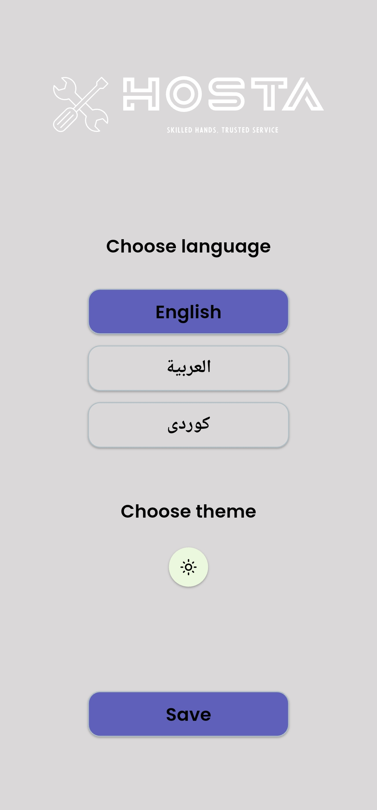 | 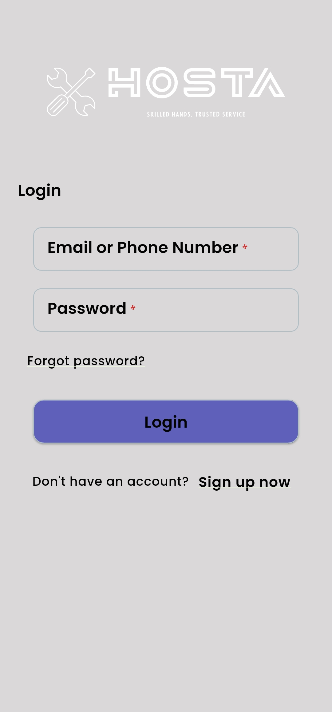 |

### Home & Navigation
| Home | Drawer |
|------|--------|
| 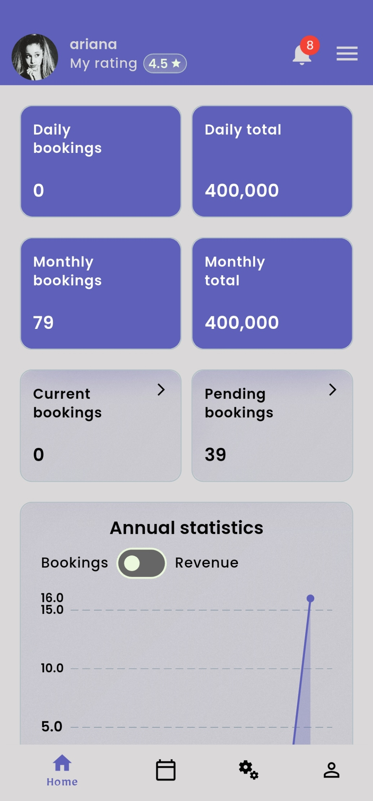 | 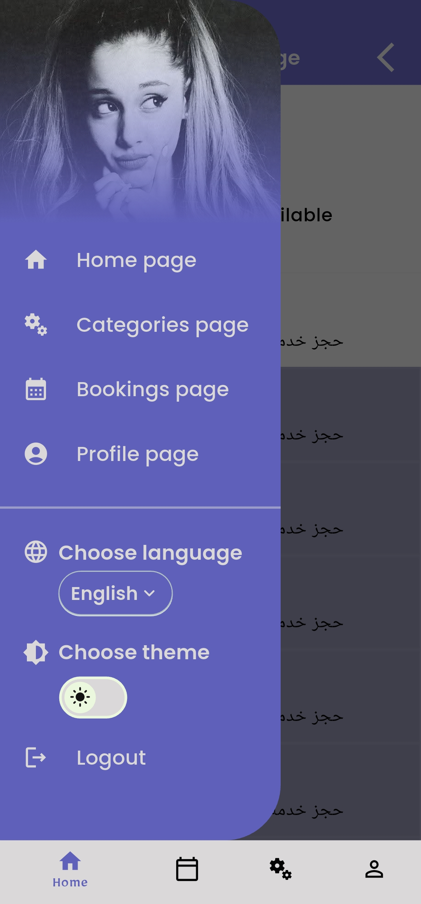 |

### Booking Flow
| Booking | Booking Info |
|---------|--------------|
| 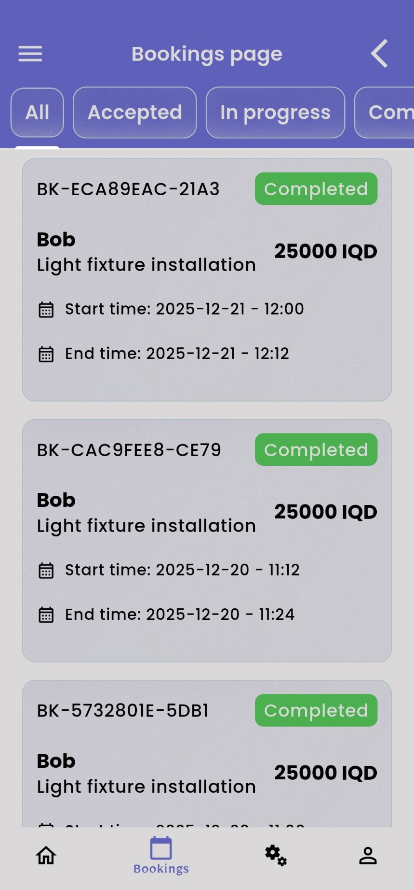 | 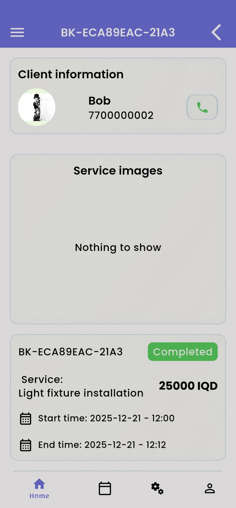 |

### Services & Notifications
| Service | Notifications |
|---------|---------------|
| 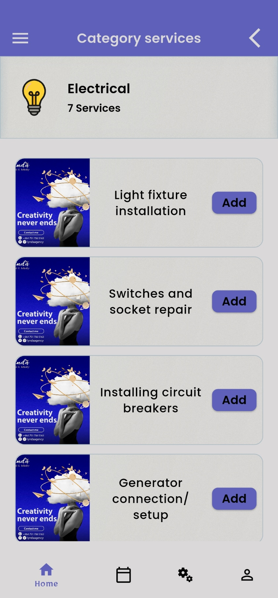 | 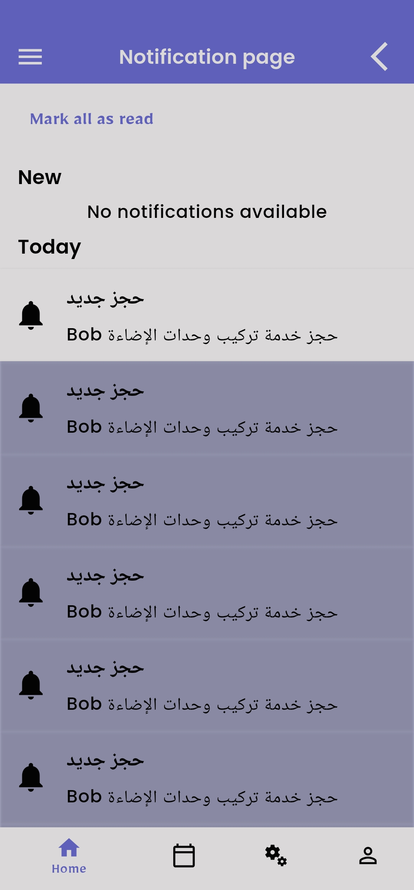 |

### Account & Profile
| Account | Profile |
|---------|---------|
| 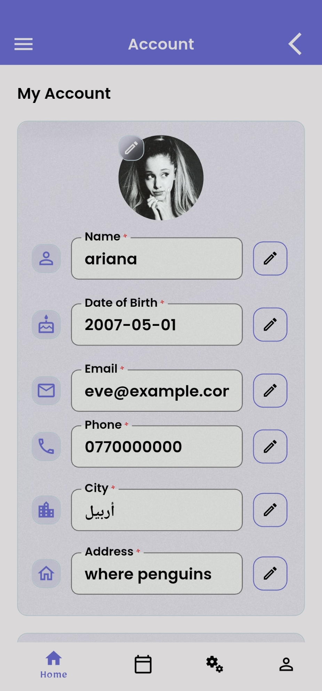 | 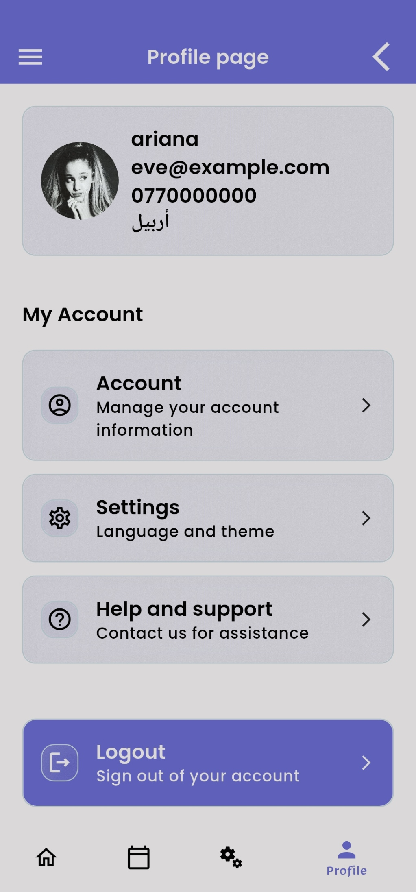 |

| Account (More) |
|---------------|
| 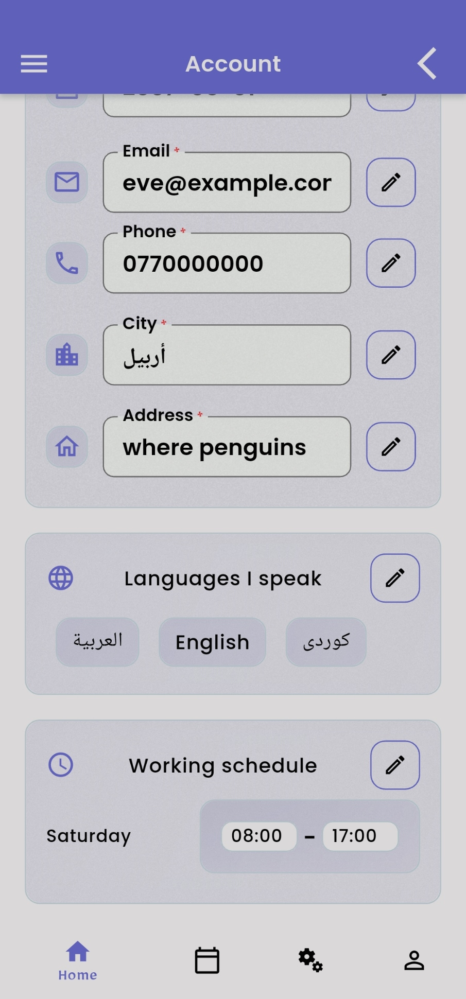 |
